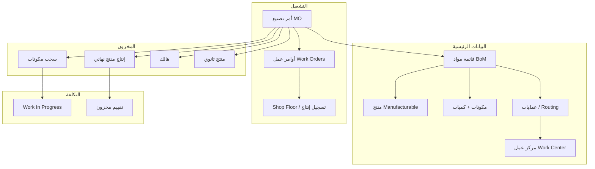

# CLOTEX — دراسة معمقة: تصنيع Odoo (MRP) كمرجع لبناء قسم التصنيع

**النوع:** دراسة مرجعية — بدون تنفيذ كود  
**التاريخ:** 2025-06-05  
**الغرض:** تجهيز معلومات جاهزة للعميل (الأب) وفريق التطوير قبل اعتماد وتسعير مشروع التصنيع  
**المرجع الأساسي:** [Odoo Manufacturing (MRP) — الإصدارات 17–19](https://www.odoo.com/documentation/18.0/applications/inventory_and_mrp/manufacturing.html)  
**السياق:** CLOTEX ERP — مستودعات أقمشة، بكرات (`fabric_rolls`)، معمل تركيا + مستودع/معمل سوريا مستقبلاً

---

## 1. الملخص التنفيذي

**Odoo Manufacturing (وحدة MRP)** من أقوى المراجع المفتوحة والموثّقة لبناء نظام تصنيع داخل ERP — وليس بالضرورة «نسخ Odoo حرفياً». السبب:

1. **نموذج واضح:** منتج → BoM → أمر تصنيع → استهلاك مواد → إنتاج → مخزون → تكلفة.
2. **مرونة التعقيد:** من معمل بخطوة واحدة إلى مراكز عمل وجداول ومتعاقدين فرعيين.
3. **تتبع الدفعات/Lot:** قريب جداً من منطق **بكرات الأقمشة** (طول متغير، ليس كمية ثابتة لكل وحدة).
4. **مجتمع صناعي:** حالات نسيج/لفات/أمتار مناقشة في منتدى Odoo — يمكن الاستفادة منها في تصميم CLOTEX.

**الوضع الحالي في CLOTEX:**

| العنصر | CLOTEX اليوم | Odoo MRP |
|--------|--------------|----------|
| شاشة `/manufacturing` | واجهة Mock (`useState` ثابت) | نظام كامل |
| API / جداول تصنيع | **غير موجود** | `mrp.production`, BoM, work orders… |
| مخزون الأقمشة | `fabric_rolls` + `inventory_movements` — **حقيقي** | Lot/Serial + stock moves |
| المناقلة الداخلية | `inventory_transfers` — حقيقي | Internal transfers + MRP pickings |

**الاستنتاج:** Odoo مرجع ممتاز؛ CLOTEX يحتاج **طبقة تصنيع جديدة** مربوطة بـ `fabric_rolls` — وليس تفعيل الشاشة الحالية فقط.

---

## 2. لماذا Odoo «الأفضل» كمرجع — وليس كحل جاهز

### 2.1 ما يفعله Odoo بشكل استثنائي

- ربط **التصنيع ↔ المخزون ↔ المحاسبة** في مسار واحد.
- **أوامر التصنيع (MO)** كوثيقة تشغيلية رسمية — كل شيء يُشتق منها.
- **BoM** كـ «وصفة» قابلة للإصدارات والمتغيرات.
- **Work Orders** لتوزيع العمل على مراكز (قص، خياطة، تشطيب…).
- **استهلاك مرن (Flexible Consumption)** — مهم جداً للأقمشة حيث الاستهلاك الفعلي ≠ النظري.
- **هالك / منتجات ثانوية / تفكيك** — سيناريوهات واقعية في النسيج.

### 2.2 ما لا يناسب CLOTEX من Odoo «كما هو»

| موضوع | Odoo الافتراضي | CLOTEX |
|-------|----------------|--------|
| وحدة القياس | متر/كيلو عام | **بكرة** بباركود + طول متبقٍ |
| تتبع اللفة | Lot برقم + كمية بالمتر | `fabric_rolls` مع `barcode`, `length_m`, `status` |
| طول غير دقيق لكل لفة | يحتاج تخصيص في المنتدى | **جوهر النظام** عندكم |
| كيانان TR/SY | Multi-company في Odoo | `company_id` — نفس الفكرة |
| واجهة عربي/تركي | i18n Odoo | مشروعكم منفصل |

**القرار التصميمي:**  
**منهجية Odoo + نموذج بكرات CLOTEX** = الهجين الصحيح.

---

## 3. هيكل وحدة التصنيع في Odoo (خريطة المفاهيم)



### 3.1 المصطلحات الأساسية (عربي ↔ Odoo)

| المصطلح | Odoo | المعنى في معمل أقمشة |
|---------|------|----------------------|
| **Bill of Materials (BoM)** | `mrp.bom` | كم متر قماش + خيوط + أزرار + بطانة لصنف واحد |
| **Manufacturing Order (MO)** | `mrp.production` | «اصنع 500 قطعة من الموديل X» |
| **Work Center** | `mrp.workcenter` | خط قص، طاولة خياطة، غرفة صباغة |
| **Work Order** | عملية على MO | مرحلة «قص» ثم «خياطة» |
| **Routing / Operations** | تبويب Operations في BoM | تسلسل المراحل |
| **Component** | سطر في BoM | خامة مستهلكة |
| **Finished Product** | منتج الـ MO | منتج جاهز للمستودع |
| **Lot / Serial** | تتبع دفعة | **رقم بكرة + طول** |
| **Scrap** | موقع افتراضي Scrap | قصاصات، عيوب، فاقد |
| **By-Product** | مخرج ثانوي | بقايا قابلة للبيع أو تدوير |
| **Unbuild** | عكس التصنيع | إرجاع خامات من منتج مجمّع |

---

## 4. الإعداد الأساسي في Odoo (Basic Setup)

### 4.1 تهيئة المنتج للتصنيع

حسب [توثيق Odoo — Manufacturing product configuration](https://www.odoo.com/documentation/17.0/applications/inventory_and_mrp/manufacturing/basic_setup/configure_manufacturing_product.html):

1. على صفحة المنتج → تبويب Inventory → تفعيل مسار **Manufacture**.
2. إنشاء **BoM** مرتبط بالمنتج (كمية الإنتاج المرجعية، مثلاً 1 وحدة أو 100 متر).
3. (اختياري) **Lot/Serial tracking** للمنتج النهائي أو المكونات.

### 4.2 قائمة المواد (BoM)

حسب [Bill of materials — Odoo 18](https://www.odoo.com/documentation/18.0/applications/inventory_and_mrp/manufacturing/basic_setup/bill_configuration.html):

**تبويب Components:**

- المكونات وكمياتها لكل كمية إنتاج مرجعية.
- **Consumed in Operation:** أي مرحلة تستهلك أي مادة.
- **Manual Consumption:** إجبار العامل على تأكيد الاستهلاك يدوياً.

**تبويب Operations** (يتطلب تفعيل Work Orders):

- اسم العملية (قص، تجميع…).
- **Work Center** المسؤول.
- **مدة افتراضية** للتخطيط والجدولة.

**تبويب Miscellaneous — إعدادات حاسمة:**

| الإعداد | الخيارات | أهمية للأقمشة |
|---------|----------|---------------|
| **Flexible Consumption** | Blocked / Allowed / Allowed with Warning | **Allowed with Warning** — الاستهلاك الفعلي يختلف عن BoM |
| **Manufacturing Readiness** | مكونات أول عملية / كل المكونات | بدء القص قبل وصول البطانة؟ |
| **Days to prepare MO** | أيام تجهيز | توريد خامات متأخر |

**تبويب By-products** (اختياري):

- مخلفات ذات قيمة (قصاصات كبيرة قابلة للبيع) مع **Cost Share**.

### 4.3 خطوات التصنيع في المستودع (1 / 2 / 3)

حسب [One-step manufacturing — Odoo 18](https://www.odoo.com/documentation/18.0/applications/inventory_and_mrp/manufacturing/basic_setup/one_step_manufacturing.html):

يُضبط على مستوى **المستودع**:

| النمط | ماذا يحدث | متى يناسب CLOTEX |
|-------|-----------|------------------|
| **خطوة واحدة** | MO فقط — استهلاك وإنتاج بدون تحويلات منفصلة | معمل صغير، نفس المبنى |
| **خطوتان** | سحب مكونات → تصنيع | معمل يفصل المخزن عن خط الإنتاج |
| **ثلاث خطوات** | سحب → تصنيع → إيداع منتج جاهز | معمل كبير + مستودع إنتاج TFG |

**توصية لمعمل أقمشة تركيا (مرحلة 1):** خطوتان أو ثلاث — أوضح محاسبياً.  
**سوريا (مستودع فقط حالياً):** قد لا يحتاج تصنيع في البداية.

---

## 5. دورة حياة أمر التصنيع (Manufacturing Order)

### 5.1 الحالات النموذجية

```text
Draft → Confirmed → In Progress (Work Orders) → To Close → Done
                              ↓
                         Cancelled
```

### 5.2 سير العمل الأساسي

1. **إنشاء MO:** منتج + BoM + كمية + تاريخ مستهدف.
2. **Confirm:** حجز/تخطيط المكونات.
3. **Work Orders:** Start → Done لكل مرحلة (أو Shop Floor).
4. **Produce All / Register Production:** تسجيل الكمية المنتجة فعلياً.
5. **Mark Done:** تحديث المخزون + إقفال التكلفة.

### 5.3 Shop Floor (أرضية المصنع)

- واجهة تابلت للعمال.
- خطوات مرئية على بطاقة كل Work Order.
- **Register Production** — تسجيل الكمية المنتجة.
- تتبع وقت التنفيذ (للتكلفة والكفاءة OEE).

**لـ CLOTEX:** Shop Floor كامل **مرحلة متقدمة**؛ المرحلة 1 يمكن أن تكون من شاشة MO على الكمبيوتر.

---

## 6. الإعدادات المتقدمة (Advanced Configuration)

### 6.1 Work Order Dependencies

- عملية «خياطة» لا تبدأ قبل انتهاء «قص».
- يُفعّل من: Manufacturing → Configuration → Settings.

### 6.2 مراكز العمل (Work Centers)

- آلة قص CNC، طاولات خياطة، غرفة مراجعة جودة.
- سعة زمنية للجدولة.
- **Time Off** — توقف الصيانة.

### 6.3 منتجات نصف مصنعة (Semi-finished)

- BoM متداخلة: «قماش مقصوص» يُصنع ثم يُستهلك في «منتج نهائي».
- مفيد إذا القص يحدث دفعة والخياطة لاحقاً.

### 6.4 Kits (مجموعات)

- تجميع بدون تحويل حقيقي — **ليس** تصنيع أقمشة؛ يُستثنى من نطاق المعمل.

### 6.5 متغيرات المنتج (Variants)

- نفس الموديل بألوان/مقاسات — BoM مختلفة لكل متغير.

---

## 7. سير العمل المتقدم (Workflows)

### 7.1 الهالك أثناء التصنيع (Scrap)

مرجع: [Scrap during manufacturing — Odoo 19](https://www.odoo.com/documentation/19.0/applications/inventory_and_mrp/manufacturing/workflows/scrap_manufacturing.html)

- **قبل الإتمام:** هالك **مكونات** فقط (قماش تالف أثناء القص).
- **بعد الإتمام:** هالك **منتج نهائي** (عيوب بعد الخياطة).
- يُنقل إلى موقع افتراضي `Virtual Locations/Scrap`.
- **Replenish Scrapped Quantities:** إعادة طلب المكون التالف (مع التصنيع 2/3 خطوات).

**تطبيق CLOTEX:** ربط الهالك بـ **أمتار م consumed من بكرة محددة** + سبب (قص، عيب لون، إلخ).

### 7.2 المنتجات الثانوية (By-Products)

مرجع: [By-Products — Odoo 19](https://www.odoo.com/documentation/19.0/applications/inventory_and_mrp/manufacturing/workflows/byproducts.html)

- مخرجات إضافية تدخل المخزون (قصاصات كبيرة، أنابيب ورق…).
- **Cost Share %** — توزيع تكلفة الإنتاج بين الرئيسي والثانوي.

### 7.3 تفكيك الطلب (Unbuild)

مرجع: [Unbuild orders](https://www.odoo.com/documentation/saas-19.3/applications/inventory_and_mrp/manufacturing/workflows/unbuild_orders.html)

- إرجاع مكونات من منتج مجمّع إلى المخزون.
- مفيد: إنتاج زائد، إعادة استخدام خامات.

### 7.4 أوامر متأخرة / تقسيم / دمج (Backorders, Split, Merge)

- إنتاج 80 من 100 → backorder للـ 20 المتبقية.
- دمج أوامر متشابهة لتحسين الكفاءة.

### 7.5 التصنيع الخارجي (Subcontracting)

- إرسال خامات لمورد يعيدها مصنعة.
- Dropship / Resupply — سلاسل توريد معقدة.

**لـ CLOTEX:** قد ينطبق لاحقاً (تشطيب خارجي، صباغة عند طرف ثالث) — **ليست أولوية مرحلة 1**.

### 7.6 Master Production Schedule (MPS)

- تخطيط إنتاج على مستوى أعلى من أوامر اليوم — **مرحلة ناضجة**.

---

## 8. التتبع بالدفعات والأرقام التسلسلية (Lots / Serials)

مرجع: [Manufacture with lots and serial numbers — Odoo 19](https://www.odoo.com/documentation/19.0/applications/inventory_and_mrp/manufacturing/workflows/manufacture_lots_serials.html)

- **Lot:** دفعة واحدة لعدة وحدات (مناسب للأقمشة).
- **Serial:** وحدة فريدة (أقل شيوعاً في القماش بالمتر).

**عند الإنتاج:** يجب تعيين Lot قبل أو عند Produce All.

---

## 9. التصنيع والأقمشة — دروس من مجتمع Odoo

### 9.1 استهلاك جزء من لفة كبيرة

[منتدى Odoo — استهلاك 50 سم من لفة 100 متر](https://www.odoo.com/forum/help-1/manufacturing-bom-raw-material-consumption-50cm-from-a-much-larger-roll-xx-cm-285171):

- BoM بالوحدة الأساسية (متر/سم).
- شراء باللفة مع تحويل وحدات.
- **Odoo الافتراضي** يخصم الاستهلاك **النظري** من BoM.
- تتبع **الطول المتبقي لكل لفة بدقة** يحتاج **تخصيص** — وهذا بالضبط ما يفعله CLOTEX بـ `fabric_rolls`.

### 9.2 تصنيع وبيع لفات بأطوال مختلفة

[منتدى Odoo — Manufacture and sell of fabric rolls](https://www.odoo.com/forum/help-1/manufacture-and-sell-of-fabric-rolls-208886):

- **لا** تعرّف UoM «لفة = 50 متر ثابت» — الأطوال غير دقيقة.
- استخدم **المتر** في المبيعات والتصنيع.
- **Lot** = معرف اللفة + **الطول الفعلي** عند التأكيد.
- Work Center + Work Order لتسجيل **كل لفة وطولها** عند الإنتاج.
- Odoo قد ينشئ MO فرعي في الخلفية لكل lot — منطق يُستلهم لا يُنسخ حرفياً.

### 9.3 بكرات مشتراة (Cable drum / textile roll)

[Openfellas — Lot-managed purchased products](https://openfellas.com/en_US/blog/news-openfellas-odoo-1/lot-managed-purchased-products-in-odoo-18-28):

- فئة وحدة: **المتر** مرجع.
- تتبع **By Lots** لكل بكرة.
- عند الاستلام: lot + **الكمية الفعلية بالمتر** (من الوزن أو القياس).
- مراقبة **ما تبقى على البكرة** عند كل استهلاك.

### 9.4 الاستنتاج لـ CLOTEX

| مفهوم Odoo | تطبيق CLOTEX المقترح |
|------------|----------------------|
| Product (component) | `fabric_items` / `fabric_item_variants` |
| Lot | **`fabric_rolls`** (`barcode`, `length_m`, `remaining_m`) |
| BoM line (2.5 m fabric) | سطر نظري بالمتر |
| MO consumption | حركة `inventory_movements` من بكرة محددة |
| Flexible consumption | فرق نظري/فعلي + هالك |
| Finished product | منتج تصنيع جديد (جدول `manufactured_products` أو توسيع الأصناف) |

**ميزة CLOTEX على Odoo الافتراضي:** البنية **`fabric_rolls`** أصلية — أقوى من Lot العام في Odoo للنسيج.

---

## 10. التكلفة والمحاسبة في Odoo

### 10.1 مسار التكلفة

```text
مواد خام (تكلفة شراء) → WIP أثناء MO → منتج تام (تكلفة إنتاج)
```

- طرق التقييم: **FIFO / Average Cost (AVCO)**.
- **Cost Share** للمنتجات الثانوية.
- **Scrap** → حساب خسارة / مصروف هالك.

### 10.2 تكامل دفتر الأستاذ

- Odoo يرحّل قيوداً تلقائية مع **Inventory Valuation**.
- CLOTEX لديه `gl_accounts`, `journal_entries`, `glPostingService` — التصنيع يجب أن يُرحّل بنفس النمط (مرحلة 2–3).

### 10.3 تقارير التصنيع

- **Production Analysis** — كم أُنتج، هالك، زمن.
- **OEE** — كفاءة المعدات (يتطلب Shop Floor + أوقات).
- **Allocation reports** — توزيع التكاليف.

---

## 11. التصنيع في بيئة متعددة الكيانات (تركيا + سوريا)

يتماشى مع [مواصفة الاعتماد TR/SY](./CLOTEX_TURKEY_SYRIA_MULTI_ENTITY_APPROVAL_SPEC.md):

| القاعدة | التطبيق على التصنيع |
|---------|---------------------|
| كل MO تابع لـ `company_id` | معمل تركيا ≠ سوريا |
| BoM ومراكز عمل لكل كيان | قد تختلف الخطوط والعملة |
| استهلاك بكرات | فقط بكرات **نفس الكيان** |
| مناقلة TR → SY | **ليست** استهلاك تصنيع — **مناقلة مخزون** (موجودة/مخططة) |
| معمل سوريا لاحقاً | نسخ/استنساخ BoM ومراكز — بيانات منفصلة |

**الأب (مدير متعدد الكيانات):** يرى أوامر تصنيع البلدين بتبديل الكيان — لا خلط في MO واحد.

---

## 12. فجوة CLOTEX الحالية — تحليل مقارن

### 12.1 ما هو جاهز ويُبنى عليه

| المكوّن | الملف / الجدول | الجاهزية |
|---------|----------------|----------|
| بكرات مخزون | `fabric_rolls`, `inventory_movements` | عالي |
| مستودعات | `warehouses`, `locations` | عالي |
| أصناف أقمشة | `fabric_items`, variants, colors | عالي |
| مناقلة داخلية | `inventory_transfers` | متوسط — بين كيانين لاحقاً |
| شاشة تصنيع | `Manufacturing.tsx` | **Mock فقط** |
| GL | `financeRoutes`, `glPostingService` | متوسط — ربط تصنيع غير موجود |

### 12.2 ما يجب إنشاؤه (مستوحى من Odoo)

| الكيان المقترح | يعادل Odoo | أولوية |
|----------------|------------|--------|
| `manufacturing_boms` | `mrp.bom` | P0 |
| `manufacturing_bom_lines` | component lines | P0 |
| `manufacturing_orders` | `mrp.production` | P0 |
| `manufacturing_order_lines` | components to consume | P0 |
| `manufacturing_operations` | routing / work orders | P1 |
| `work_centers` | `mrp.workcenter` | P1 |
| `manufacturing_scrap` | scrap moves | P1 |
| `manufacturing_byproducts` | by-products | P2 |
| ربط استهلاك بكرة | custom > Odoo lots | P0 |

---

## 13. خطة تنفيذ CLOTEX مستوحاة من Odoo (مراحل)

### المرحلة 0 — ورشة مع الأب (قبل كود)

- ماذا يُصنع؟ (ثوب جاهز، تفصيل حسب طلب، نصف مصنع…)
- هل الاستهلاك **بالمتر** من بكرة محددة إلزامي؟
- كم مرحلة إنتاج؟ (قص فقط / قص+خياطة+تشطيب)
- هل يوجد هالك معياري %؟
- ربط محاسبي من اليوم الأول أم لاحقاً؟

### المرحلة 1 — MVP (مكافئ Odoo: BoM + MO خطوة واحدة)

- تعريف منتج تام + BoM (مكونات بالمتر/وحدة).
- إنشاء MO وتأكيده.
- **استهلاك بكرات:** اختيار `fabric_roll_id` + أمتار مستهلكة.
- إنتاج كمية منتج تام → مستودع.
- هالك بسيط (أمتار + سبب).
- تقرير: أوامر مفتوحة / مكتملة / استهلاك خام.

**لا يشمل:** Shop Floor، subcontracting، MPS، OEE.

### المرحلة 2 — عمليات ومراكز (Work Orders)

- مراكز عمل.
- تسلسل عمليات على BoM.
- حالات MO per operation.
- تتبع زمن (اختياري).

### المرحلة 3 — تكلفة ومحاسبة

- تكلفة MO = خامات + (عمالة لاحقاً) + هالك.
- قيود GL عند إتمام MO.
- تقارير هامش إنتاج.

### المرحلة 4 — متقدم

- By-products، Unbuild.
- Backorders وتقسيم MO.
- Shop Floor مبسط (تابلت).
- تكامل مع مناقلة TR→SY (خامات مرسلة للمعمل السوري لاحقاً).

---

## 14. ما نأخذه من Odoo حرفياً vs ما نخصصه

| من Odoo «كما هو» | مخصص لـ CLOTEX |
|------------------|----------------|
| هيكل BoM → MO → Done | ربط الاستهلاك بـ `fabric_rolls` |
| Flexible consumption | `remaining_m` على البكرة |
| Work centers & operations | مراحل معمل القماش |
| Scrap / By-product مفهوم | جداول هالك مرتبطة بالبكرة |
| 2-step / 3-step warehouse | مستودع إنتاج تركيا |
| Shop Floor كامل | مرحلة 4 أو أبسط |
| Odoo i18n | عربي/تركي CLOTEX |
| Multi-company | `CLOTEX-TR` / `CLOTEX-SY` |

---

## 15. مخاطر وقرارات تصميم

| المخاطرة | التخفيف |
|----------|---------|
| بناء تصنيع قبل استقرار المخزون | ✅ المخزون حقيقي عندكم — جيد |
| استهلاك نظري دون بكرة | إجبار اختيار بكرة عند Confirm MO |
| تعقيد Odoo كامل دفعة واحدة | MVP مرحلة 1 فقط |
| خلط كيان TR/SY | `company_id` إلزامي في كل استعلام |
| الأب يريد «مثل Odoo» لكن بسعر منخفض | عرض مراحل + سعر لكل مرحلة |

---

## 16. أسئلة جاهزة لاجتماع الأب (قائمة ورشة)

1. قائمة 5–10 منتجات تامة نبدأ بها BoM.
2. لكل منتج: مكونات بالمتر + نسب هالك متوقعة.
3. هل القص يستهلك بكرة كاملة أم جزء منها؟
4. هل المنتج التام يُخزّن بمتر أم بوحدة (قطعة)؟
5. هل تحتاجون تتبع «أي بكرة دخلت في أي طلبية عميل»؟
6. التصنيع في سوريا: متى؟ نفس BoM أم مختلف؟
7. تقارير إلزامية شهر 1: (استهلاك خام / إنتاج / هالك).

---

## 17. تقدير جهد تقريبي (للتخطيط — ليس عرض سعر نهائي)

| المرحلة | نطاق الجهد | ملاحظة |
|---------|------------|--------|
| MVP (BoM + MO + بكرات) | 4–8 أسابيع عمل مركّز | بدون Shop Floor |
| Work Orders + مراكز | +3–5 أسابيع | |
| تكلفة + GL | +2–4 أسابيع | يعتمد على نضج المحاسبة |
| متقدم (Odoo-like كامل) | +8–16 أسبوعاً | مشروع طويل |

*الأرقام للتخطيط الداخلي؛ التسعير للعميل يبقى منفصلاً حسب نطاق الورشة.*

---

## 18. مراجع رسمية ومفيدة

| الموضوع | الرابط |
|---------|--------|
| نظرة عامة Manufacturing | https://www.odoo.com/documentation/18.0/applications/inventory_and_mrp/manufacturing.html |
| تهيئة منتج | https://www.odoo.com/documentation/17.0/applications/inventory_and_mrp/manufacturing/basic_setup/configure_manufacturing_product.html |
| BoM | https://www.odoo.com/documentation/18.0/applications/inventory_and_mrp/manufacturing/basic_setup/bill_configuration.html |
| خطوة واحدة | https://www.odoo.com/documentation/18.0/applications/inventory_and_mrp/manufacturing/basic_setup/one_step_manufacturing.html |
| Lots في التصنيع | https://www.odoo.com/documentation/19.0/applications/inventory_and_mrp/manufacturing/workflows/manufacture_lots_serials.html |
| Scrap | https://www.odoo.com/documentation/19.0/applications/inventory_and_mrp/manufacturing/workflows/scrap_manufacturing.html |
| By-Products | https://www.odoo.com/documentation/19.0/applications/inventory_and_mrp/manufacturing/workflows/byproducts.html |
| Unbuild | https://www.odoo.com/documentation/saas-19.3/applications/inventory_and_mrp/manufacturing/workflows/unbuild_orders.html |
| منتدى — لفات بأطوال مختلفة | https://www.odoo.com/forum/help-1/manufacture-and-sell-of-fabric-rolls-208886 |
| منتدى — استهلاك من لفة | https://www.odoo.com/forum/help-1/manufacturing-bom-raw-material-consumption-50cm-from-a-much-larger-roll-xx-cm-285171 |

---

## 19. الخلاصة النهائية

1. **Odoo Manufacturing مرجع ممتاز** — المنطق، المصطلحات، والمراحل — وليس منتجاً تُثبّتونه كما هو.
2. **CLOTEX لديه أساس أقوى من Odoo الافتراضي في تتبع البكرات** — يجب أن يكون قلب استهلاك التصنيع.
3. **الشاشة الحالية `Manufacturing.tsx`** إعلان نية فقط؛ التنفيذ = جداول + API + ربط مخزون.
4. **ابدأوا بـ MVP Odoo-like:** BoM + MO + استهلاك بكرة + هالك — ثم Work Orders ثم محاسبة.
5. **تركيا أولاً** للتصنيع؛ سوريا مستودع ثم معمل — مع `company_id` صارم.
6. **ورشة الأب** تحدد النطاق قبل أي تسعير نهائي — خاصة مع عميل حساس للسعر.

---

## 20. وثائق مرتبطة في المشروع

- [CLOTEX_TURKEY_SYRIA_MULTI_ENTITY_APPROVAL_SPEC.md](./CLOTEX_TURKEY_SYRIA_MULTI_ENTITY_APPROVAL_SPEC.md) — عزل تركيا/سوريا
- [FABRIC_WAREHOUSE_DEEP_DISCOVERY_AND_CLOUD_ARCHITECTURE_REPORT.md](./FABRIC_WAREHOUSE_DEEP_DISCOVERY_AND_CLOUD_ARCHITECTURE_REPORT.md) — نموذج البكرات والمخزون
- [PROJECT_DEEP_STATUS_REPORT.md](./PROJECT_DEEP_STATUS_REPORT.md) — حالة Manufacturing = Mock

---

*نهاية الدراسة — جاهزة للمراجعة مع الأب وتحويلها لاحقاً إلى مواصفة تنفيذ (PRD) عند الموافقة.*
